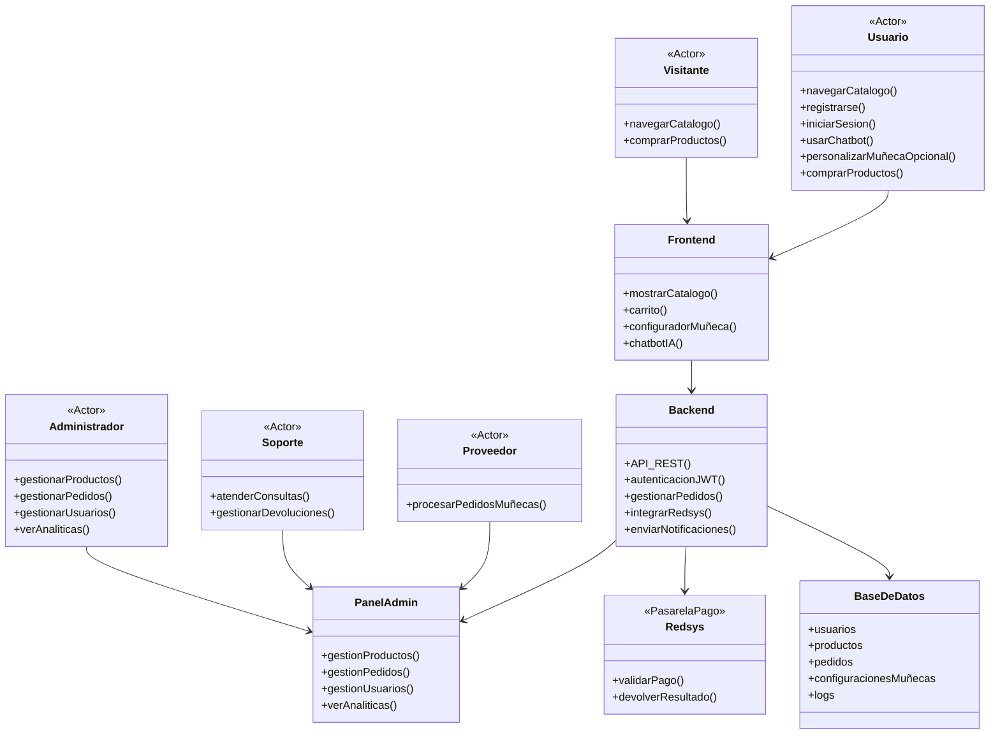
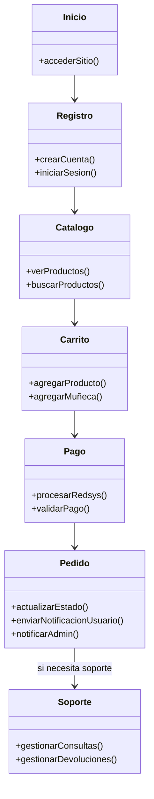

```mermaid
classDiagram
    class Usuario {
        <<Actor>>
        +navegarCatalogo()
        +registrarse()
        +iniciarSesion()
        +usarChatbot()
        +personalizarMuñecaOpcional()
        +comprarProductos()
    }

    class Visitante {
        <<Actor>>
        +navegarCatalogo()
        +comprarProductos()
    }

    class Administrador {
        <<Actor>>
        +gestionarProductos()
        +gestionarPedidos()
        +gestionarUsuarios()
        +verAnaliticas()
    }

    class Soporte {
        <<Actor>>
        +atenderConsultas()
        +gestionarDevoluciones()
    }

    class Proveedor {
        <<Actor>>
        +procesarPedidosMuñecas()
    }

    class Frontend {
        +mostrarCatalogo()
        +carrito()
        +configuradorMuñeca()
        +chatbotIA()
    }

    class Backend {
        +API_REST()
        +autenticacionJWT()
        +gestionarPedidos()
        +integrarRedsys()
        +enviarNotificaciones()
    }

    class BaseDeDatos {
        +usuarios
        +productos
        +pedidos
        +configuracionesMuñecas
        +logs
    }

    class Redsys {
        <<PasarelaPago>>
        +validarPago()
        +devolverResultado()
    }

    class PanelAdmin {
        +gestionProductos()
        +gestionPedidos()
        +gestionUsuarios()
        +verAnaliticas()
    }

    Usuario --> Frontend
    Visitante --> Frontend
    Administrador --> PanelAdmin
    Soporte --> PanelAdmin
    Proveedor --> PanelAdmin

    Frontend --> Backend
    Backend --> BaseDeDatos
    Backend --> Redsys
    Backend --> PanelAdmin
```
---

```mermaid
classDiagram
    class Inicio {
        +accederSitio()
    }

    class Registro {
        +crearCuenta()
        +iniciarSesion()
    }

    class Catalogo {
        +verProductos()
        +buscarProductos()
    }

    class Carrito {
        +agregarProducto()
        +agregarMuñeca()
    }

    class Pago {
        +procesarRedsys()
        +validarPago()
    }

    class Pedido {
        +actualizarEstado()
        +enviarNotificacionUsuario()
        +notificarAdmin()
    }

    class Soporte {
        +gestionarConsultas()
        +gestionarDevoluciones()
    }

    Inicio --> Registro
    Registro --> Catalogo
    Catalogo --> Carrito
    Carrito --> Pago
    Pago --> Pedido
    Pedido --> Soporte : si necesita soporte

```