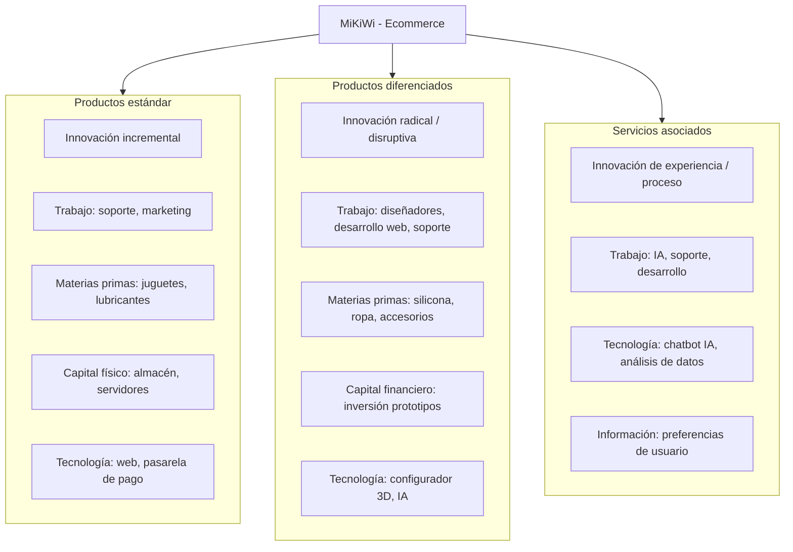

```mermaid
graph TD
    A[MiKiWi - Ecommerce]

    subgraph Std[Productos estándar]
        B1[Innovación incremental]
        B2[Trabajo: soporte, marketing]
        B3[Materias primas: juguetes, lubricantes]
        B4[Capital físico: almacén, servidores]
        B5[Tecnología: web, pasarela de pago]
    end

    subgraph Diff[Productos diferenciados]
        C1[Innovación radical / disruptiva]
        C2[Trabajo: diseñadores, desarrollo web, soporte]
        C3[Materias primas: silicona, ropa, accesorios]
        C4[Capital financiero: inversión prototipos]
        C5[Tecnología: configurador 3D, IA]
    end

    subgraph Serv[Servicios asociados]
        D1[Innovación de experiencia / proceso]
        D2[Trabajo: IA, soporte, desarrollo]
        D3[Tecnología: chatbot IA, análisis de datos]
        D4[Información: preferencias de usuario]
    end

    A --> Std
    A --> Diff
    A --> Serv

```